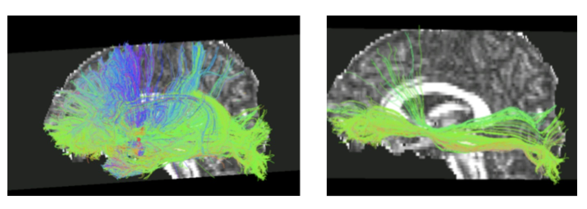
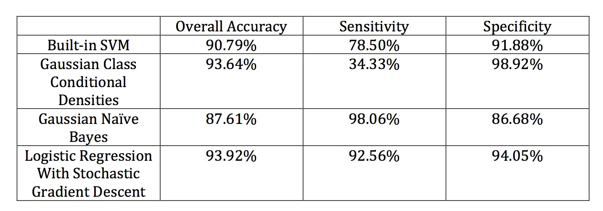
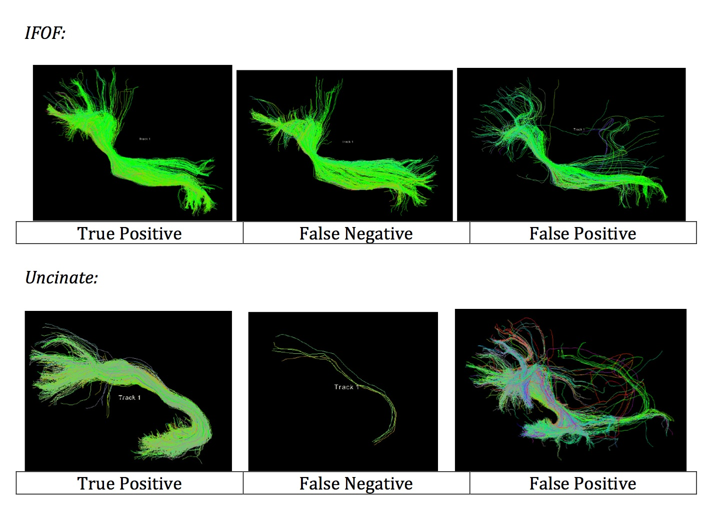
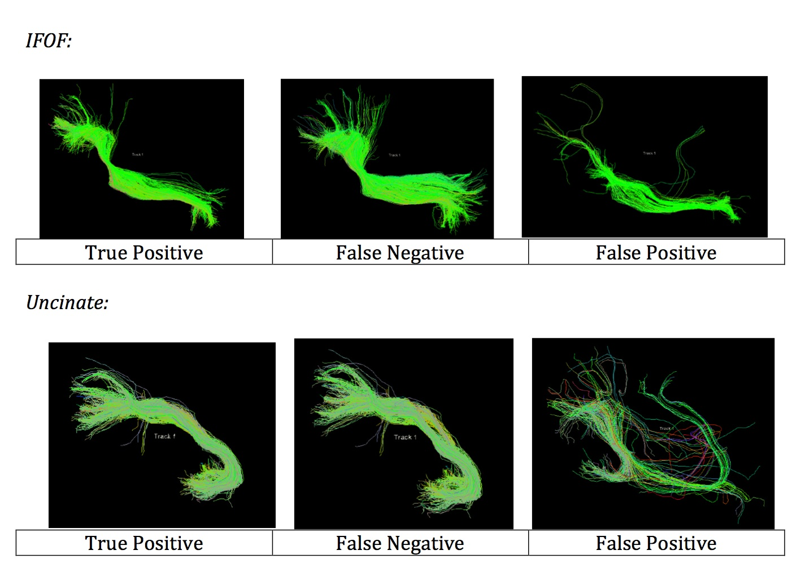
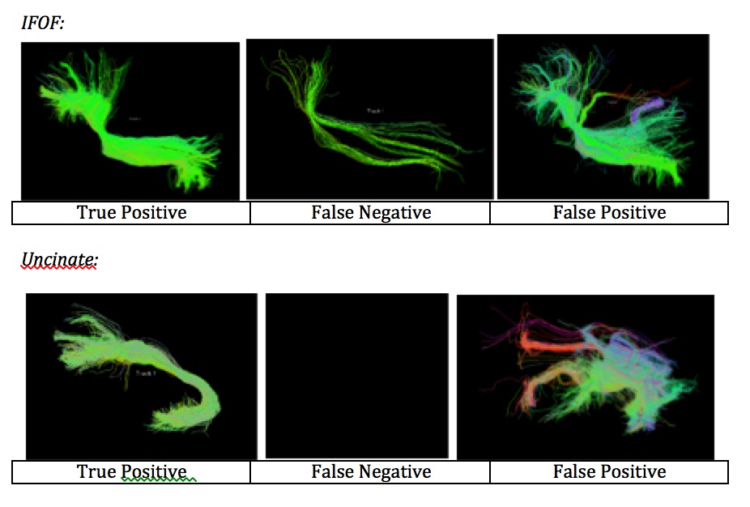
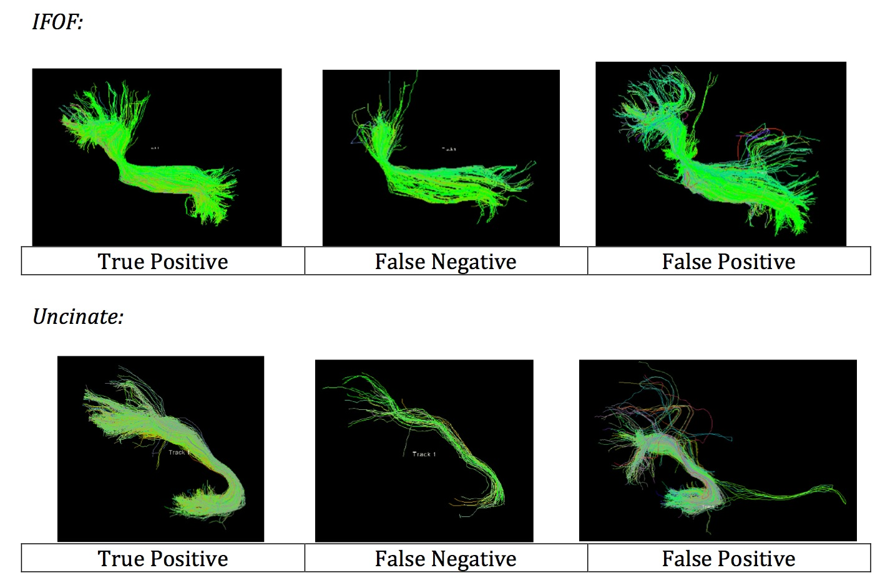

# BrainTractographyClassification

This work is related to this abstract from ISMRM 2015:
Automatic Classification of Brain Tractography Data, E Datta, K Jordan, E Cavezasi, N Papinutto, W Stern, and RG Henry, 2015.
dev.ismrm.org/2015/2851.html

This work is also related to this abstract from HBM 2015:
Variability in Automatic and Mannual Classification of Brain Tractography Data, E Datta, K Jordan, E Cavezasi, N Papinutto, W Stern, and RG Henry, 2015.

## Overview

The purpose of this project is to compare different methods for classification of human brain tractography data. Human brain tractography data is often classified for use in pre-neurosurgical planning to map important brain connections that are considered critical to motor and language function.  Traditionally, this process is performed manually by trained experts, so it would be of great value to have an automatic classification process.  In this project, each method is used to classify a set of tracts from the left External Capsule into three categories: Inferior Fronto-Occipital Fasciculus (IFOF), Uncinate Fasciculus, and noise.  In the above figure, the picture on the left shows the input set of tracts and the picture on the right shows the desired output of the segmented IFOF.

## Methods

### Feature Vector
The feature vector ultimately used to represent each streamline included the length of the contour, the end-to-end length, the ratio of contour length and end-to-end length, and the actual coordinates of the endpoints

### Classification Methods
* Built in SVM Model
* Gaussian Class Conditional Densities Model
* Gaussian Naive Bayes Model
* Logistical Reggression with Stochastic Gradient Descent

## Results
### Overview

### Discussion
The Gaussian Class Conditional Densities model has the best overall accuracy and also the best specificity. However, this may be a poor and risky choice for this application. The algorithm only correctly identifies a small percentage of the streamlines. If a doctor were to use these results to plan a brain surgery, the chance of accidentally cutting into an important motor or language tract would be high.

The Gaussian Naïve Bayes model has the best sensitivity. This would be a very conservative estimate for this application. The algorithm catches nearly all of the important streamlines, but it also includes a lot of noise streamlines as well. The surgeon could be fairly confident that he would be able to avoid the important areas when cutting into the brain. However, this approach is also prohibitive and may unnecessarily prevent the doctor from performing needed surgery in certain areas.

The Logistic Regression model with stochastic gradient descent seems to be the best overall approach for pre-surgical mapping. The sensitivity and specificity are both fairly high, so there is a good balance between the risk of underestimating and overestimating the tract.
### Built in SVM

### Gaussian Class Conditional Densities Model

### Gaussian Naive Bayes Model

### Logistical Regression with Stochastic Gradient Descent

